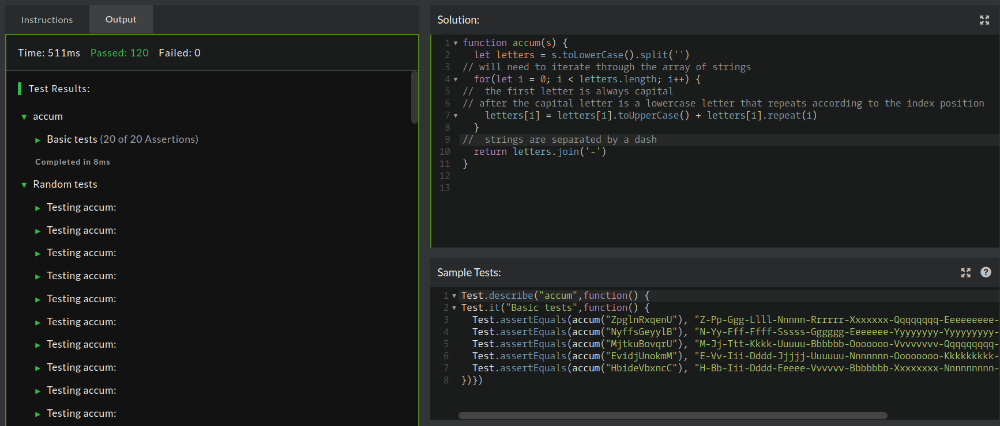

## CodeWars Challenge- 8

This time no story, no theory. The examples below show you how to write function accum:

*Examples Given:*
1. accum("abcd");    // "A-Bb-Ccc-Dddd"
2. accum("RqaEzty"); // "R-Qq-Aaa-Eeee-Zzzzz-Tttttt-Yyyyyyy"
3. accum("cwAt");    // "C-Ww-Aaa-Tttt"

The parameter of accum is a string which includes only letters from a..z and A..Z.

## Solved Using:

1. JavaScript

## My solution:

In order to solve this code problem it was vital I fully understood what the input was and what output was expected, this is the first CodeWar I notice has little to no instruction.

The capitalization of the string being passed in did no seem to determine anything for the output, instead I notice the first letter was always capitalized and depending on the letters position,it was  followed by a lower case letter. The letters seem to repeat, the first does not repeat, the second is one upper case and one lower case of the same letter and then the third follows the pattern, the first letter is capitalized followed by two lower case letters.

When I started writing my function I know I will want to use the toLowerCase method in order to convert all the letters in the string to loswer case, then I split the string into an array of strings. By splitting the string into an array of strings I'm able to iterate over each letter, as an element of the array using it's index position. Now that I had all of my letters in an array of strings I needed to return the string while recreating the pattern I noticed in the examples given.

For each letter I set the letter equal to itself and use the toUpperCase method to achieve the first bit of the pattern(each letter starts with a capitalized version of the letter). I then use the repeat method on the current letter with the index position of that current letter. This will occur for each letter in the array of strings, the last step is to return the letters using the join method to join the strings with a dash separating them from the next letter, and voila! 
